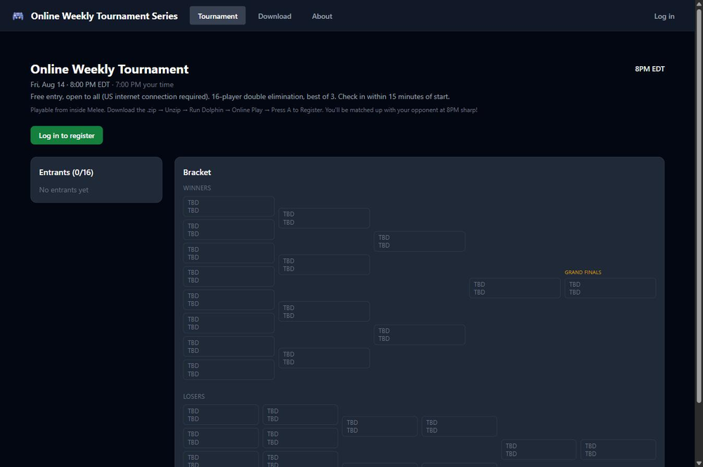
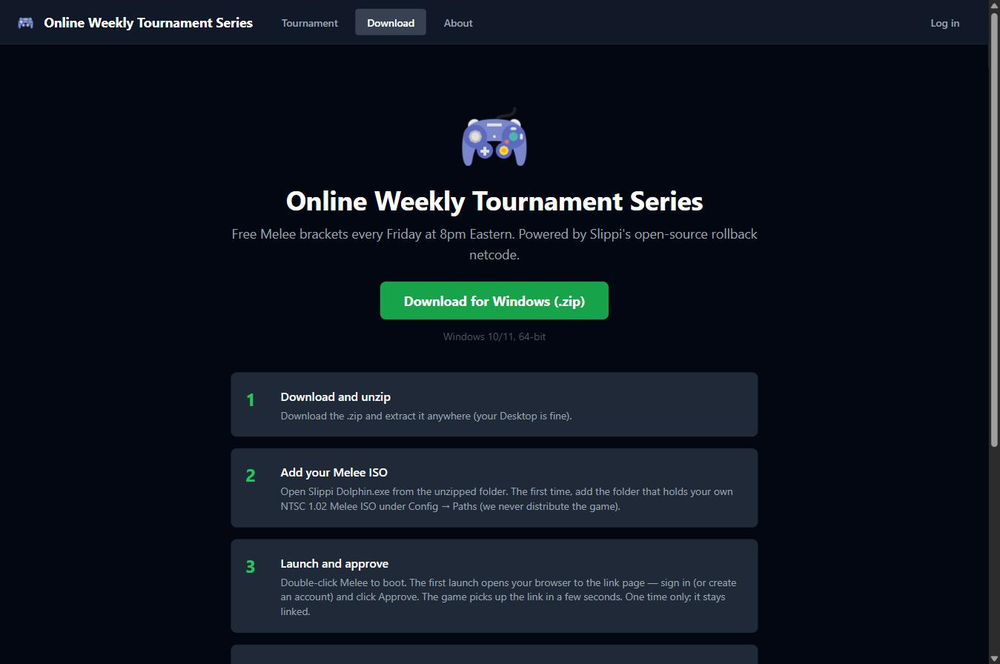
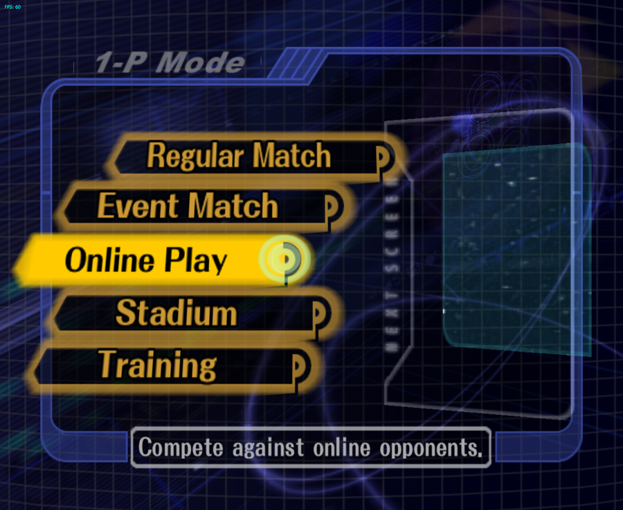
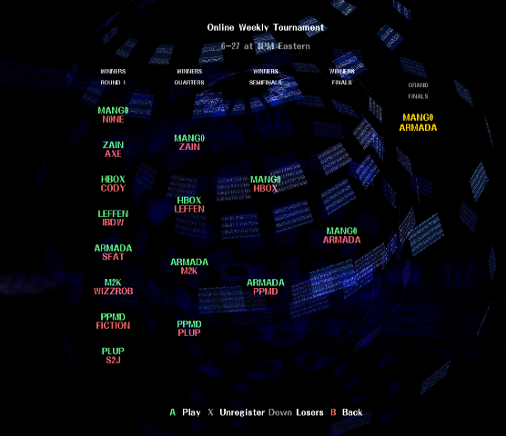
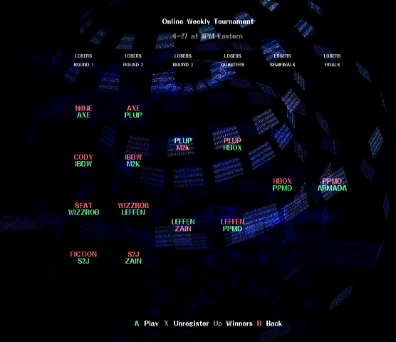
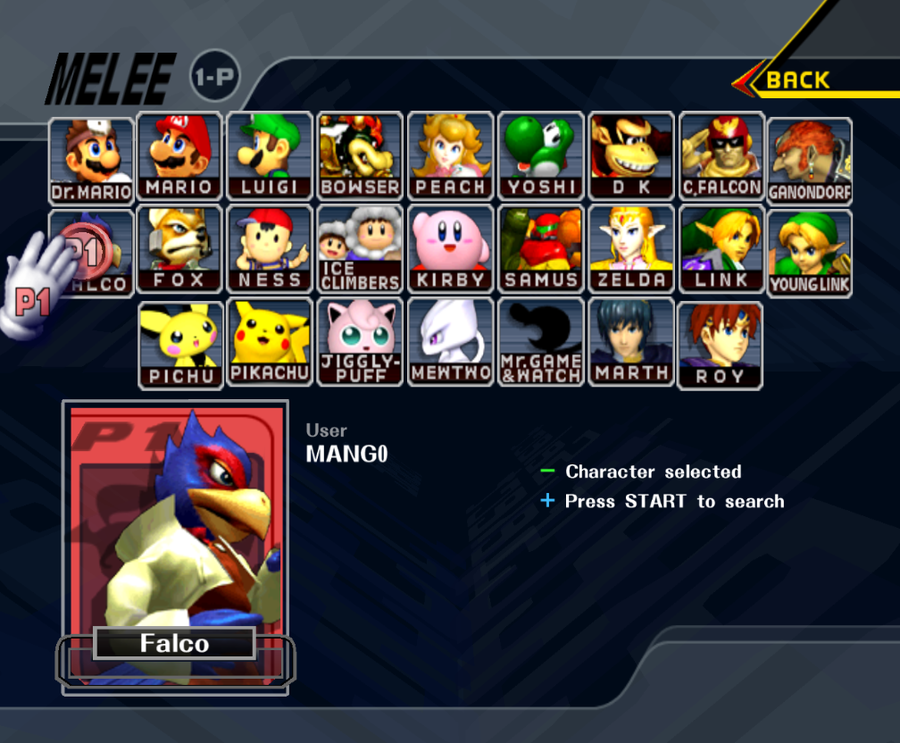
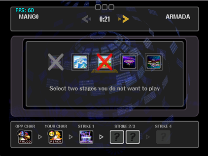
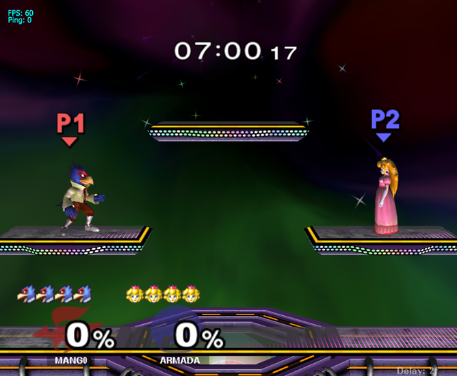

# Online Weekly Tournament Series

A free, fully-online Super Smash Bros. Melee tournament that runs **inside the game**,
every Friday at 8PM Eastern.

No start.gg. No Discord wrangling. No messaging your opponent to start the set. You
launch Melee, press A to register, and the bracket runs itself: pairing, stage
striking, result reporting, and advancement all happen in-game.

**Live:** [onlineweeklytournaments.com](https://onlineweeklytournaments.com)

This repo is the **backend and website**. The game client (a Slippi Dolphin fork with
the in-game tournament scenes) lives in
[`online-weekly-tournaments-melee`](https://github.com/Robert-Liam-Walker/online-weekly-tournaments-melee).

---

## Built on Project Slippi

This project is built on top of [Project Slippi](https://slippi.gg), which is itself
built on the [Dolphin emulator](https://dolphin-emu.org). Nothing here would work
without them, and it's worth being precise about which part is whose:

| | |
|---|---|
| **The client repo is a fork.** | [`online-weekly-tournaments-melee`](https://github.com/Robert-Liam-Walker/online-weekly-tournaments-melee) vendors forks of four Slippi projects: Ishiiruka (the emulator), `slippi-ssbm-asm`, `slippi-ssbm-c`, and the launcher. All emulation and all rollback netcode is inherited from them, unmodified. It stays GPL. |
| **This repo is not a fork.** | The API, website, and bracket engine are original code with no vendored upstream source. Its one Slippi dependency is the npm package [`@slippi/slippi-js`](https://github.com/project-slippi/slippi-js), used to parse `.slp` replay files. |

What this repo *does* replace is Slippi's **matchmaking server**. Slippi's netcode is
open source but its matchmaking service is not, so the UDP rendezvous registrar here
(§ [How the system fits together](#how-the-system-fits-together)) is an independent
reimplementation of that role: it pairs the two players of a bracket match and swaps
their public endpoints. `mm.slippi.gg` is never contacted, and both end-to-end gates were
run with it blocked in `hosts` to prove it. Once paired, the match runs on Slippi's
own rollback netcode, peer-to-peer.

**This project is not affiliated with or endorsed by Project Slippi or Nintendo.**

---

## The website

The companion site is deliberately thin. There is no sign-in wall: anyone can read the
bracket and grab the client. Registering and playing happen inside the game.

<p align="center">
  
</p>

`/tournament` is the whole site's center of gravity: one event, its entrant list, and
the full double-elimination bracket rendered live from the same API the game reads.
Empty slots show as TBD until the bracket is seeded at start time.

<p align="center">
  
</p>

`/download` is the funnel. One portable `.zip`, four steps, no launcher and no
installer. You point it at a Melee ISO you already own and the game handles login by
opening the approval page in your browser on first boot.

---

## Inside the game

The entire tournament UX is rendered inside Melee itself. These are real screenshots
from the client, not mockups.

| | |
|:--:|:--:|
|  |  |
| **1. Open Online Play.** Straight into tonight's tournament, no sign-in. | **2a. The winners bracket.** Press Y for the full double-elim bracket. |
|  |  |
| **2b. Losers bracket.** Press Down to flip sides and fight back. | **3. Character select.** No rank, no clutter, your tournament name above it. |
|  |  |
| **4. Strike for stage.** Loser of each game counterpicks the next. | **5. Play your set.** Slippi rollback, and the result reports itself. |

That bracket is drawn by the game, from this API's data. When a set ends, Slippi's
authoritative result is sent back over EXI and the bracket advances on its own.

---

## How the system fits together

```
   PLAYER PC                          AWS (us-east-1)
   ---------                          ---------------
   Slippi Dolphin fork  --HTTPS-->  CloudFront --> Elastic Beanstalk
     - in-game scenes                  |            (ONE Node process)
     - EXI + HTTP client               |             - Fastify REST
     - UDP announce                    |             - Socket.io
          |                            |             - UDP registrar :41100
          |                            v             - scheduler
          |                     S3 (React SPA)            |
          |                                               v
          +---- UDP :41100 -------------------->  Postgres (RDS) + Redis
                (NAT hole-punch, then the match      (durable)     (presence,
                 itself is peer-to-peer)                            locks, rdv)
```

Two independent transports:

- **Control plane:** REST and websockets ride HTTPS through CloudFront to Fastify.
- **Match plane:** the UDP rendezvous can't traverse CloudFront, so clients hit the
  registrar directly. Once it has swapped the two players' public endpoints, the
  actual game traffic is **peer-to-peer** and never touches our servers.

The rendezvous registrar is what replaces Slippi's closed-source matchmaking server.
The rollback netcode itself is inherited unchanged from the GPL Dolphin fork.

---

## Repo layout

A workspace monorepo. Three workspaces share the bracket engine.

```
.
├── prisma/
│   ├── schema.prisma          single source of truth for the data model
│   └── migrations/            `prisma migrate deploy` runs these on boot
├── packages/
│   └── shared/                @foxtrot/shared (pure, no IO)
│       └── src/bracket.ts     the double-elimination engine
├── apps/
│   ├── api/                   Fastify backend
│   │   └── src/
│   │       ├── index.ts       composition root
│   │       ├── udpRegistrar.ts        stateless UDP shell
│   │       ├── routes/                one module per REST surface
│   │       └── lib/
│   │           ├── bracketService.ts  engine ↔ DB bridge
│   │           ├── rendezvous.ts      pairing state machine (Redis)
│   │           └── scheduleTournaments.ts
│   └── web/                   React + Vite SPA
└── docs/
    └── ARCHITECTURE.md        the full system map, start here
```

**The hard rule:** `packages/shared` is pure: no Prisma, no Redis, no `fetch`. That is
what lets the bracket engine be unit-tested exhaustively and reused identically
everywhere else.

---

## The bracket engine

The most interesting code in the repo is `packages/shared/src/bracket.ts`, and the
design decision behind it: **engine state is never serialized.**

`TournamentMatch` rows are the only persisted bracket state. To compute anything, the
service rebuilds the pure engine from `(seeded entries) + (recorded winners)` by
replay, mutates it, then mirrors the result back into rows:

```
every mutation  =  rebuild → mutate → persist
```

Because that's a read-modify-write, every mutation runs under a per-tournament Redis
mutex. Recorded results that don't replay cleanly throw rather than silently diverge.

Internally the bracket is a **dataflow graph** (each slot is either a seed, the winner
of another match, or the loser of another match), and `propagate()` is a fixpoint loop
that resolves slots and auto-completes byes until nothing changes. Byes are how
check-in no-shows are handled for free.

Match keys are stable strings every layer references: `W1-3`, `L4-1`, `GF`, `GFR`.

---

## Tech stack

| Layer | Choice |
|---|---|
| API | Fastify, TypeScript, `@fastify/jwt`, helmet, Redis-backed rate limiting |
| Realtime | Socket.io, sharing Fastify's HTTP server (one port) |
| Pairing | `dgram` UDP registrar, Redis-backed state machine |
| Database | PostgreSQL 16 via Prisma |
| Cache / coordination | Redis: presence, rate limits, rendezvous, per-tournament locks |
| Web | React 18, Vite, Tailwind, TanStack Query, Zustand |
| Infra | Elastic Beanstalk (Docker), RDS, ElastiCache, S3 + CloudFront, SES |
| CI/CD | GitHub Actions → ECR/EB (api), S3 + CloudFront invalidation (web) |

---

## Local development

**Prerequisites:** Node 20+, Docker.

```bash
npm install

# Postgres + Redis
docker compose up -d

cp apps/api/.env.example apps/api/.env
cp apps/web/.env.example apps/web/.env

npx prisma migrate dev

npm run dev          # runs api + web together
```

Run the tests:

```bash
npm test --workspace=packages/shared    # bracket engine
npm test --workspace=apps/api           # API unit tests
```

The UDP registrar is **opt-in**: it only binds when `RENDEZVOUS_UDP_PORT` is set, so
local dev and parallel test runs never fight over the socket.

---

## Rules of the series

1. 16-player double elimination, best of 3.
2. Standard Melee ruleset: 4 stocks, 8-minute timer, items off.
3. Legal stages: Battlefield, Final Destination, Pokémon Stadium, Yoshi's Story,
   Fountain of Dreams, Dream Land 64.
4. Game one's stage is decided by striking; the loser of each game picks the next.
5. No stalling.
6. Three no-shows is a ban.
7. Play fair and be respectful.

---

## Project status

This is a working MVP running real weekly events, with deliberate gaps. The honest
list, kept current in [`docs/ARCHITECTURE.md`](docs/ARCHITECTURE.md) §17:

- **Availability:** API, websockets, UDP registrar, and scheduler are all one process
  on a single instance. Simple and cheap; also a single point of failure. Scaling out
  needs the Socket.io Redis adapter, sticky sessions, and an NLB for UDP.
- **Integrity:** result reporting is participant-trust in v1. Replay verification
  flags mismatches but is not yet authoritative.
- **Observability:** no error tracking, metrics, or alerting yet. The scheduler
  heartbeat log is the only liveness signal.
- **Environments:** no staging; `main` deploys straight to production.

---

## Naming note

The product has been rebranded several times. The user-facing brand is **Online Weekly
Tournament Series**; the git history, code identifiers, AWS resource names, and
`FOXTROT_*` env vars still use `foxtrot` as the internal codename. Treat it as such
when reading the source.
